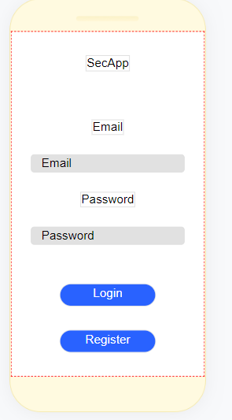
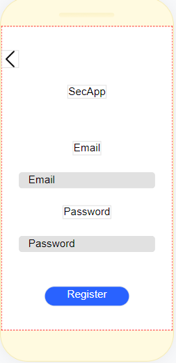
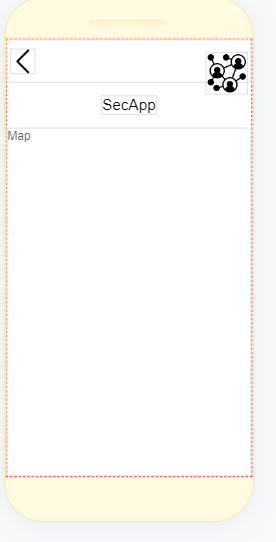
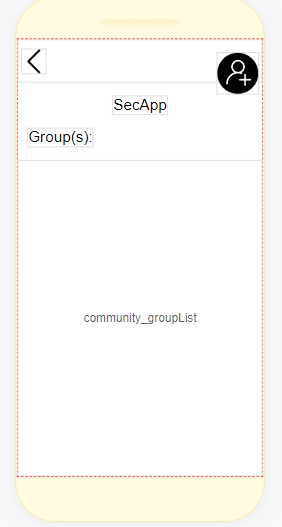
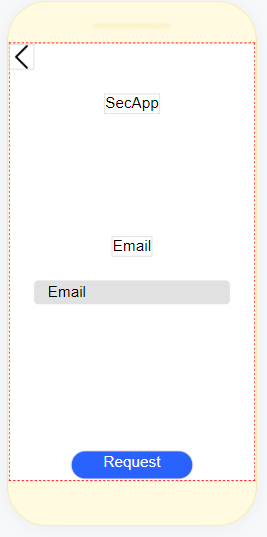
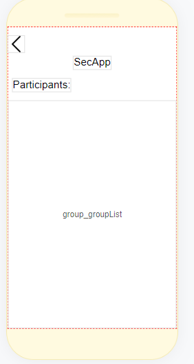
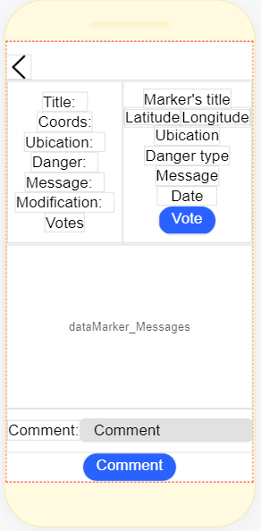

# Tarea corta #2: SecApp
> Integrantes:
>
>> 
* Max Richard Lee Chung - 2019185076 
* Miguel Ku Liang - 2019061913
* Sebastian Campos Zuniga - 2016140230
* Dylan Stef Torres Walker - 2018135751

## Guía de instalación
El programa necesita tener instalado Python como lenguaje base para la interfaz de programación de aplicaciones o API, Ngrok para publicar en línea los datos de la base de datos de Firebase, utilizando como medio el lenguaje Python con Flask y Postman para poder crear pedidos, con el fin de obtener, actualizar, borrar o actualizar datos de la base. Además, se utilizará Thunkable para la parte de experiencia de usuario.  

### Firebase
Como se mencionó anteriormente, es necesario tener una cuenta de Google cualquiera para poder alojar una base de datos en la nube que nos brinda este servicio, de este modo, se puede tener acceso a un almacenamiento en formato JSON. Además, nos permite crear de forma automática la autenticación y registro de un usuario a la aplicación. 

Luego de haber creado la cuenta de Firebase, en el lado derecho, existen varias categorías de producto en donde ocupamos la base de datos a tiempo real. Al crear la base a tiempo real, es necesario copiar el URL generado y guardarlo para conectar aplicaciones externas a la base de datos, ubicada dentro de la pestaña “Datos”. Además, es importante cambiar las reglas para poder acceder a los datos sin problemas como se observa a continuación en la pestaña de “Reglas”. 

```
{
  "rules": {
    ".read": true,
    ".write": true
  }
}
```

Dentro de la configuración (ubicada en un ícono de engranaje en la esquina superior izquierda) se debe de crear una aplicación web dentro del espacio “Tus apps” en la pestaña “General” para poder tener el acceso a la base de datos a tiempo real desde Thunkable, el cual se expondrá posteriormente.

Además, dentro de la configuración del proyecto, en la pestaña “Cuentas de servicio”, es necesario generar credenciales SDK de Firebase Admin para utilizarlas en Python, en donde sólo se ocupa generar nueva clave y descargar el archivo generado. 

Como se mencionó anteriormente sobre la autentificación, en la misma categoría de productos, existe la opción de “Autentificación”, el cual tiene de forma predeterminada funciones para verificar y registrar un usuario. Dentro de esta tarea corta, se habilitó el registro por medio de correo y contraseña con mínimo 6 caracteres. 

### Python
Python es esencial para poder usar nuestra API para que transmita la información de Firebase a la aplicación como tal alojada en Thunkable, por lo que es necesario tener las siguientes librerías para poder ejecutar el sistema.

```
pip install flask               #flask
pip install ngrok               #flask_ngrok
pip install  flask_cors         #flask_cors 
pip install firebase_admin      #firebase_admin 
```

La primera librería nos permite crear una aplicación para crear peticiones por medio de rutas web. La segunda librería nos permite crear una página en línea que contenga o muestre la información de la base de datos por medio de las peticiones de la primera librería. La tercera librería nos permite eliminar ciertas restricciones que impone el navegador para visualizar los registros desde otras páginas externas. Por último, la cuarta librería nos permite crear la conexión directa con la base de datos alojada en Firebase. Con el fin de que todas las librerías funcionen en la misma aplicación, se ejecutaron de la siguiente manera la variable que contiene la aplicación a ejecutar.

```
app = Flask(__name__)   # Declaración de flask
CORS(app)               # Elimina las restricciones
run_with_ngrok(app)     # Ejecuta la app con Ngrok
```

Como se mencionó anteriormente, la API se conecta a la base de datos de la siguiente manera, donde se verifica primero las credenciales del usuario por medio del archivo generado previamente y alojado en la misma carpeta del archivo Python. Además, es necesario aplicar la dirección URL de la base de datos en tiempo real de Firebase para realizar la conexión directa. 

```
# Ingreso los datos de las credenciales del archivo descargado
cred = credentials.Certificate('adminSecret.json')
# Se conecta a la base de datos a tiempo real con la cuenta correspondiente.
firebase_admin.initialize_app(cred, {
    'databaseURL': 'https://tareacorta2-2f12e-default-rtdb.firebaseio.com/'
})
```

Por último, se crean las peticiones de Flask con los métodos para acceso “CRUD” (crear, leer, actualizar y borrar) del archivo JSON guardado en la base de datos como se muestra a continuación en sus respectivos módulos del programa. 

```
####
# Users request
# 

# Add user to the database
@app.route('/user', methods=['POST'])
def addUser():
    # Global JSON path
    ref = db.reference('/')
    # Create a child in the node Users
    ref.child("Users").child(str(request.json['id'])).set({
        'email': request.json['email'],
        'friends': request.json['friends']
    })
    return jsonify(ref.get())

# Add friend from a user UID
@app.route('/addFriend/<int:data>', methods=['POST'])
def addFriend(data):
    # Global JSON path
    ref = db.reference('/Users/' + str(data))
    # Get all the data from the reference
    user = ref.get()
    try:
        # Update the friends list
        ref.update({
            'friends': user["friends"] + [request.json['id']]
        })
    except:
        # Create a list of friends if they dont have one
        ref.update({
            'friends': [request.json['id']]
        })
    return jsonify(ref.get())

####
# Community request
#

# Add group of community to the database
@app.route('/addGroup/<int:data>', methods=['POST'])
def addGroup(data):
    # Global JSON path
    ref = db.reference('/')
    # Create a child in the node Community
    ref.child("Community").child(str(request.json['name'])).set({
        'participants': [data],
        'messages': ["Welcome to " + request.json['name'] + "'s group"]
    })
    return jsonify(ref.get())

# Add a message to the group to the database
@app.route('/addMessageGroup/<name>', methods=['POST'])
def addMessageGroup(name):
    # Path for the community node with the specific group
    ref = db.reference('/Community/' + str(name))
    # Get all the data from the reference
    group = ref.get()
    ref.update({
        # Add message to the list
        'messages': group["messages"] + [request.json['message']]
    })
    return jsonify(ref.get())

# Add participant to a group
@app.route('/addPerson/<name>', methods=['POST'])
def addPerson(name):
    ref = db.reference('/Community/' + str(name))
    # Get all the data from the reference
    group = ref.get()
    try:
        # Update the participants list
        ref.update({
            'participants': group["participants"] + [request.json['id']]
        })
    except:
        # Create the participants list if they dont have one
        ref.update({
            'participants': [request.json['id']]
        })
    return jsonify(ref.get())

####
# Markers request
#

# Add a marker to the database
@app.route('/marker', methods=['POST'])
def addMarker():
    # Global JSON path
    ref = db.reference('/')
    ref.child("Markers").child(str(request.json['title'])).set({
        'latitude': request.json['latitude'],
        'longitude': request.json['longitude'],
        'danger': request.json['danger'],
        'date': request.json['date'],
        'hour': request.json['hour'],
        'message': request.json['message'],
        'comments': [request.json['comment']],
        'ubication': request.json['ubication'],
        'vote': 1,
        'lastModification': request.json['lastMod']
    })
    return jsonify(ref.get())

# Add a comment to the comments
@app.route('/comment/<name>', methods=['POST'])
def addComment(name):
    # Path to the Marker node with the specific marker
    ref = db.reference('/Markers/' + str(name))
    # Get all the data from the reference
    marker = ref.get()
    # Add a comment to the comments
    ref.update({
        'comments': marker["comments"] + [request.json['comment']],
        'lastModification': request.json['lastMod']
    })
    return jsonify(ref.get())

# +1 vote
@app.route('/vote/<name>', methods=['POST'])
def vote(name):
    # Path to the Markers node with the specific mark
    ref = db.reference('/Markers/' + str(name))
    # Get all the data from the reference
    group = ref.get()
    # Update +1 to the votes counter
    ref.update({
        'vote': group["vote"] + 1,
        'lastModification': request.json['lastMod']
    })
    return jsonify(ref.get())

# Change danger level
@app.route('/changeDanger/<name>', methods=['POST'])
def changeDanger(name):
    # Path to the Marker node with the specific marker
    ref = db.reference('/Markers/' + str(name))
    # Update the danger level
    ref.update({
        'danger': request.json['danger'],
        'lastModification': request.json['lastMod']
    })
    return jsonify(ref.get())
```

De forma general, se crearon únicamente métodos para crear y actualizar datos de Firebase, en donde creamos nuevas secciones de la ruta (URL) para identificar el método a ejecutar junto con algún dato necesario de forma dinámica. Además, utilizamos el cuerpo de las peticiones para extraer datos más complejos en un paquete para poder extraerlos de forma individual y colocarlos en cada uno de sus respectivos usos. 

Además, como la librería de Firebase nos permite ubicar los nodos a buscar y extraer con precisión los datos. De esta forma, se aprovechó la personalización de las llaves para poder crear las etiquetas específicas como se muestra en la agregación de un usuario en donde la etiqueta es la identificación única, al igual que las etiquetas de grupo y marcador. De forma similar, se buscan etiquetas y subetiquetas específicas para poder actualizar los datos, así como se muestra en agregar mensajes a un grupo, amigos, entre otros. 

Dicha estructura de ejemplo se puede observar a continuación, alojada en la base de datos Firebase

```
{
  "Community": {
    "Grupo 1": { # Nombre del grupo
      "messages": ["Welcome to Grupo 1's group"], # Mensaje inicial del grupo
      "participants": [2] # Las identificaciones de los usuarios que participan 
    },
    "Public": {
      "messages": ["Welcome to Public's group", "Hi"],
      "participants": [0, 1]
    }
  },
  "Markers": {
    "Marcador_cool": { # Nombre del marcador
      "comments": ["My comment", "Yo le creo"], # Comentarios al respecto
      "danger": 3, # Nivel de peligro
      "date": "24/10/2022", # Fecha de creación
      "hour": "13:00", # Hora de publicación
      "lastModification": "29/10/2022", # Última fecha de modificación
      "latitude": 0, # Latitud
      "longitude": 0, # Longitud
      "message": "Peligro", # Mensaje del suceso 
      "ubication": "TEC", # Ubicación 
      "vote": 1 # La cantidad de votos
    }
  },
  "Users": [
    null,
    { "email": "text" },
    { "email": "text", "friends": [null, 3, 1] }, # Correo y lista de amigos del usuario
    { "email": "text" },
    { "email": "text" }
  ]
}
```

### Postman
La herramienta nos permite crear peticiones para probar el desarrollo de la aplicación, en donde se coloca el URL que otorga Ngrok a la hora de ejecutar el archivo .py junto con la ruta establecida previamente con el método, ya sea GET o POST. Dicho URL se obtiene al ejecutar el archivo de Python en la terminal, en donde se mostrará una interfaz de Ngrok, el cual se debe de utilizar el link al lado derecho de la etiqueta “Forwarding” y guardarlo para la última configuración posterior. Además, en Postman, se puede ingresar un cuerpo en formato JSON con los datos para que en la API de Python se pueda extraer como se mencionó anteriormente. 

```
# Insertar un usuario, con la debida información requerida en el cuerpo
<URL>/user
# Ejemplo del cuerpo
{
    "id": 10,
    "email": "email",
    "friends": "[]"
}
```

### Thunkable
De la misma manera que Firebase, se debe de crear una nueva cualquiera o utilizar la misma para Firebase. Esta herramienta, como se ha mencionado previamente, es quien va a tener la interfaz gráfica para que el usuario pueda interactuar con el sistema. Sin embargo, se debe de seguir ciertos pasos previamente, como por ejemplo, crear una componente invisible de “Web API”, el cual va a tener como primera configuración la URL para extraer datos. Dicha URL será la misma cuando se ejecute el archivo de Python en la pantalla de Ngrok, como se mencionó previamente.

Luego, se deben de crear otros componentes invisibles para la implementación de Firebase llamados Sign_in y Realtime_DB. Dentro de configuraciones avanzadas, la primera opción solicita una llave API y URL de la base de datos, el cual se obtiene en la información obtenida de la Web App de Firebase creada previamente. La segunda opción, solicita únicamente el URL de la base de datos a tiempo real de Firebase, mencionado previamente también. 

Por último, solo se debe de agregar los componentes invisibles de preferencia, en este caso, se agregaron los componentes para crear alertas para notificar algún caso de error en las validaciosnes y el sensor de localización para la implementación del servicio Maps de Google.

De forma general, se crearon 7 ventanas para los casos de inicio de sesión, registro de nuevo usuario, menú principal, menú de comunidad, agregar un amigo, ver grupos, ver la descripción de cada grupo y la descripción de los marcadores de peligros con su respectiva lógica y control de flujo.


## Uso de la aplicación

### Pantalla de inicio de sesión
Pantalla principal de la aplicación, tiene campos para solicitar el email y la contraseña del usuario de forma segura. Además tiene dos botones, “Login” y “ Registro”, donde la primera valida los campos de entrada con Firebase para ver si el usuario esta registrado y la segunda para que un nuevo usuario pueda registrarse en la aplicación.



### Pantalla de Registro
Pantalla donde se redirecciona al usuario para que ingrese su email y contraseña a registrar en la aplicación y se tiene el botón de registrar que envía los datos a Firebase para que se registre el nuevo usuario. Además de un botón de retorno a la pantalla de inicio de sesión.

 

## Futuras implementaciones
### Mapa
Es la pantalla con un mapa con la ubicación en tiempo real donde el usuario ve los marcadores en el mapa y estos contienen la información de los peligros, el tipo de peligro, la hora ,fecha y la descripción del mismo.


### Pantalla de la comunidad
El usuario crea, borra y puede visualizar las comunidades que tiene. En esta pantalla el usuario puede ver las comunidades creadas por sí mismo, además a las que pertenece y de quienes participan con la opción de agregar amigo si no lo era. Se accede por el ícono de la esquina superior derecha de la pantalla del Mapa.



### Pantalla de agregar amigos
El usuario busca un amigo por medio de su correo electrónico y envía la solicitud de amistad. Además si el usuario no existe devuelve una excepción de usuario no encontrado. Tiene un field text donde se digita el usuario y un botón para enviar la solicitud de amistad.


 
### Pantalla de grupos
El usuario ingresa a esta pantalla desde la pantalla de comunidad por medio de seleccionar algún grupo, se observan los miembros actuales de una comunidad en específico y se pueden agregar o borrar miembros.



### Pantalla del menú principal de reportes de peligros
El usuario puede visualizar los peligros reportados en un área de 1 km a la redonda a la ubicación actual y los detalles del mismo.


### Reportar Peligro
El usuario reporta un peligro a los demás usuarios, además de toda la información de este peligro.




## Conclusión
El programa hace uso de las tecnologías más novedosas en el mercado como son las aplicaciones móviles, se hizo uso de la plataforma de Thunkable para hacer la aplicación, se aprendió cómo es que funciona y unas de las ventajas que tiene es que permite visualizar e interactuar con la aplicación en desarrollo con sólo descargar la app en el teléfono y realizar el inicio de sesión con la misma cuenta del proyecto. Esta plataforma utiliza una programación de bloques, esto nos llevó a conocer y aprender otra forma distinta de programar. Se aprendió a hacer un API, programado en Python con los módulos de Flask y Ngrok. Además de la utilización de bases de datos en tiempo real como es FireBase, en donde se trabajó el formato JSON en la base de datos y mediante el API se extraen, insertan, borran y actualizan los datos desde la aplicación o Postman.

## Recomendación
Se recomienda a la personas interesadas en este proyecto ya sea para su utilización o posible mejora e implementación de funcionalidades tener conocimiento básico en Python, estudiar la programación en bloques para tener una idea de cómo funciona y cómo es de diferente la programación tradicional. Estudiar y conocer cómo funciona un API y del porqué es conveniente manejar la comunicación de esta forma.

## Apéndice
### Cuenta de Google para Firebase (no incluye Thunkable)
Correo: Tareacorta2BasesDatos2@gmail.com
Contraseña: BasesdeDatos2

### Enlace de Thunkable
[Thunkable proyect](https://x.thunkable.com/copy/4fe8ce69f6cadfdf9e2b897a8315d974)

### Usuarios permitidos para el registro en la aplicación de Thunkable
Correo: admin@gmail.com
Contraseña: adminadmin

## Referencias
* Thunkable Docs (2022). Recuperdado de [Email Sign In by Firebase](https://docs.thunkable.com/sign-in)
* Thunkable Docs (2022). Recuperdado de [Map](https://docs.thunkable.com/map)
* Thunkable Docs (2022). Recuperdado de [Realtime DB by Firebase](https://docs.thunkable.com/v/snap-to-place/realtime-db)
* Firebase (2022). Recuperado de [Introduction to the Admin Database API](https://firebase.google.com/docs/database/admin/start)
* One Byte At A Time (2021). Youtube. Recuperado de [Thunkable Micro-Tutorial - Firebase Realtime Database Part I: Setup & Authentication](https://www.youtube.com/watch?v=bMLp9U5RKE8)
* Forogh, P. (2020). Youtube. Recuperado de [Python Firebase SDK Integration With Real Time Database](https://www.youtube.com/watch?v=EiddkXBK0-o)
* Flask(2010). [API](https://flask.palletsprojects.com/en/2.2.x/api/)
* García, E. (2019). [¿Cómo crear tu propia API con flask?](https://codigofacilito.com/articulos/api-flask)
* Puffelen, F. (2016). Answer. [Setting custom key when pushing new data to firebase database](https://stackoverflow.com/questions/37483406/setting-custom-key-when-pushing-new-data-to-firebase-database)

